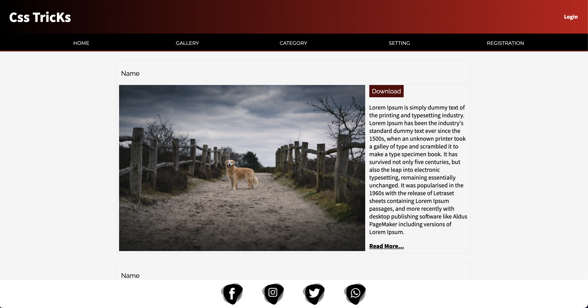

# Dynamic Menu Positioning with Switch Controls & Dark Mode

## 📌 Overview

This project enables users to:  
✅ Change the position of a menu (Top, Right, Bottom, Left) using switches.  
✅ Toggle **Dark Mode** for better user experience.  
✅ Maintain selected settings using `localStorage`.

## 🚀 Features

- 🎛️ **Switch-based menu positioning**
- 🌙 **Dark Mode toggle for better visibility**
- 🔄 **Automatic state persistence using localStorage**
- 🎯 **Ensures at least one active switch (default: Top)**
- 🖥️ **Dynamic UI updates for a smooth experience**

## 🛠️ Technologies Used

- **HTML** for structure
- **CSS** for styling (including Dark Mode support)
- **JavaScript** for interactivity

## 📖 How It Works

### **1️⃣ Menu Positioning**

- Click on a switch (**Top, Right, Bottom, Left**) to move the menu.
- The selected position is stored in `localStorage`.
- If no other switch is active, the **Top** switch remains checked.

### **2️⃣ Dark Mode**

- Click the **Dark Mode Toggle** to switch between Light and Dark modes.
- The preference is saved in `localStorage` and applied on page load.

## ⚡ Usage

1. Open `index.html` in a browser.
2. Use the switches to change the menu's position.
3. Toggle **Dark Mode** using the provided switch.
4. Refresh the page to see the persistence feature in action.

## 🔥 Preview

## 🌟 Future Enhancements

- ✅ Add smooth animations for better transitions
- ✅ Improve accessibility for better usability
